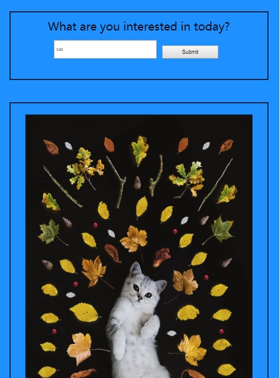

# Project: use xhr search picture

## Description
A simple **photo search engine** with **unsplash** (a website to share beautiful and free images) API.

In this project I learn how to use 'XHR' object to send and receive data asynchronously.

**Live-demo:**
https://moonfallmaple.github.io/xhr-data-request/

